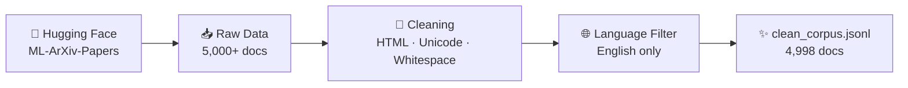

<div align="center">

# 🔍 Parallax RAG Knowledge Extractor

### *A robust data pipeline for Retrieval-Augmented Generation*


</div>

---

> ### 🎓 AI Engineer Internship — Week 1 Submission
> | | |
> |---|---|
> | **Program** | 6-Week Standard Program (Track B) |
> | **Focus** | Environment Setup, Data Ingestion & Preprocessing |

---

## 📖 Project Overview

This repository contains the foundational data pipeline for a **Retrieval-Augmented Generation (RAG)** knowledge extraction system.

The goal of Week 1 was to establish a **robust, modular, and tested environment** to ingest, clean, and validate a large-scale real-world dataset (**5,000+ ArXiv machine learning papers**) in preparation for vector database integration.

---

## 🎯 Week 1 Objectives Achieved

- ✅ Initialized a clean Git repository with a locked `requirements.txt` and proper `.gitignore`
- ✅ Created an environment verification script (`verify_env.py`) to assert library imports and GPU/CPU availability
- ✅ Ingested 5,000+ real-world documents from the Hugging Face `CShorten/ML-ArXiv-Papers` dataset
- ✅ Built a modular text cleaning pipeline (`src/preprocessing.py`) handling HTML stripping, Unicode normalization, whitespace cleanup, and language filtering
- ✅ Implemented comprehensive unit tests (`tests/test_preprocessing.py`) achieving 100% pass rate on cleaning logic
- ✅ Generated a validated, clean dataset (`clean_corpus.jsonl`) containing **4,998 English documents**

---

## 📊 Pipeline at a Glance



---

## 📂 Project Structure

```text
parallax-rag-knowledge-extractor/
├── 📁 data/
│   ├── 📁 raw/                  # Raw ingested data (git-ignored)
│   └── 📁 processed/            # Cleaned, validated output (git-ignored)
├── 📁 scripts/
│   ├── 🐍 verify_env.py         # Environment and dependency checker
│   ├── 🐍 download_data.py      # Hugging Face dataset ingestion script
│   └── 🐍 process_data.py       # Main pipeline execution script
├── 📁 src/
│   └── 🐍 preprocessing.py      # Modular text cleaning functions
├── 📁 tests/
│   └── 🐍 test_preprocessing.py # Unit tests for cleaning functions
├── 📄 .gitignore                # Ignores /data/, .env, and cache files
├── 📄 requirements.txt          # Locked dependencies
└── 📄 README.md                 # Project documentation
```

---

## ⚙️ Setup & Installation

### 1️⃣ Clone the Repository

```bash
git clone https://github.com/danishbhi29/parallax-rag-knowledge-extractor.git
cd parallax-rag-knowledge-extractor
```

### 2️⃣ Create and Activate Virtual Environment

**🪟 Windows**
```bash
python -m venv venv
venv\Scripts\activate
```

**🍎 Mac / 🐧 Linux**
```bash
python3 -m venv venv
source venv/bin/activate
```

### 3️⃣ Install Dependencies

```bash
pip install -r requirements.txt
python -m spacy download en_core_web_sm
```

---

## 🚀 How to Run the Pipeline

Follow these steps **in order** to replicate the Week 1 workflow:

### 🔹 Step 1: Verify Environment
Checks for GPU availability and validates all required library imports.

```bash
python scripts/verify_env.py
```

### 🔹 Step 2: Download Raw Data
Fetches 5,000 ArXiv papers and saves them to `data/raw/raw_documents.jsonl`.

```bash
python scripts/download_data.py
```

### 🔹 Step 3: Run Unit Tests
Validates the preprocessing logic to ensure 100% reliability.

```bash
pytest tests/test_preprocessing.py -v
```

### 🔹 Step 4: Execute Cleaning Pipeline
Processes the raw data, applies cleaning rules, filters for English, and outputs to `data/processed/clean_corpus.jsonl`.

```bash
python scripts/process_data.py
```

---

## 🧠 Key Design Decisions

| Decision | Why it matters |
|---|---|
| 🧩 **Modular Architecture** | Cleaning logic is separated into single-responsibility functions (`strip_html`, `normalize_unicode`, etc.) rather than one monolithic script. This makes debugging and testing significantly easier. |
| 📄 **JSONL Format** | The industry standard for LLM pipelines because it allows line-by-line streaming, preventing memory overload when scaling to millions of documents. |
| 🔒 **Strict Data Isolation** | The `/data/` directory is explicitly ignored in `.gitignore` to prevent bloating the Git repository with large binary/text files. |

---

<div align="center">

**⭐ If you found this project helpful, consider giving it a star! ⭐**

Made with ❤️ by [danishbhi29](https://github.com/danishbhi29)

</div>
