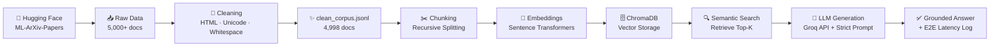

<div align="center">

# 🔍 Parallax RAG Knowledge Extractor

### *A robust, end-to-end pipeline for Retrieval-Augmented Generation*


</div>

---

> ### 🎓 AI Engineer Internship — Week 3 Submission
>
> | | |
> |---|---|
> | **Program** | 6-Week Standard Program (Track B) |
> | **Focus** | LLM Integration, Prompt Engineering, Hallucination Defense & End-to-End Latency |

---

## 📖 Project Overview

This repository contains a fully functional, end-to-end **Retrieval-Augmented Generation (RAG)** pipeline.

Building upon the foundational data cleaning (Week 1) and vector search (Week 2), **Week 3** connects the retrieved context to a Large Language Model (Groq). It implements strict prompt engineering to prevent hallucinations, handles out-of-domain queries gracefully, and logs end-to-end latency to demonstrate real-time performance.

---

## 🎯 Objectives Achieved

### Week 1: Environment & Preprocessing

- ✅ Initialized a clean Git repository with a locked `requirements.txt` and a strict `.gitignore`.
- ✅ Ingested 5,000+ real-world documents from the Hugging Face [`CShorten/ML-ArXiv-Papers`](https://huggingface.co/datasets/CShorten/ML-ArXiv-Papers) dataset.
- ✅ Built a modular text-cleaning pipeline handling HTML stripping, Unicode normalization, and language filtering.

### Week 2: RAG Pipeline & Vector Search

- ✅ Implemented and unit-tested a **recursive text chunking** strategy with context-preserving overlap.
- ✅ Generated high-dimensional embeddings using `sentence-transformers`.
- ✅ Set up a persistent **ChromaDB** vector database with **batch ingestion** to safely handle 26,000+ chunks.

### Week 3: LLM Integration & Evaluation

- ✅ Integrated a fast, free-tier LLM API (Groq) with robust error handling (timeouts, rate limits).
- ✅ Implemented strict **prompt engineering** to enforce context-only answers and gracefully handle out-of-domain queries (hallucination defense).
- ✅ Measured and logged **end-to-end latency** (retrieval + generation) to prove real-time query performance.
- ✅ Secured API keys using `.env` and ensured strict `.gitignore` compliance.

---

## 📊 Pipeline at a Glance


```mermaid
flowchart LR
    A["🤗 Hugging Face<br/>ML-ArXiv-Papers"] --> B["📥 Raw Data<br/>5,000+ docs"]
    B --> C["🧹 Cleaning<br/>HTML · Unicode · Whitespace"]
    C --> D["✨ clean_corpus.jsonl<br/>4,998 docs"]
    D --> E["✂️ Chunking<br/>Recursive Splitting"]
    E --> F["🔢 Embeddings<br/>Sentence Transformers"]
    F --> G["🗄️ ChromaDB<br/>Vector Storage"]
    G --> H["🔍 Semantic Search<br/>Retrieve Top-K"]
    H --> I["🧠 LLM Generation<br/>Groq API + Strict Prompt"]
    I --> J["✅ Grounded Answer<br/>+ E2E Latency Log"]
```

---

## 📂 Project Structure

```text
parallax-rag-knowledge-extractor/
├── 📁 data/
│   ├── 📁 raw/                   # Raw ingested data (git-ignored)
│   └── 📁 processed/             # Cleaned, validated output (git-ignored)
├── 📁 scripts/
│   ├── 🐍 verify_env.py          # Environment and dependency checker
│   ├── 🐍 download_data.py       # Hugging Face dataset ingestion script
│   ├── 🐍 process_data.py        # Week 1: Data cleaning pipeline
│   └── 🐍 run_rag_pipeline.py    # Week 3: Master RAG pipeline & E2E latency benchmark
├── 📁 src/
│   ├── 🐍 preprocessing.py       # Modular text cleaning functions
│   ├── 🐍 chunking.py            # Recursive text splitting logic
│   ├── 🐍 embeddings.py          # Sentence-transformer embedding generation
│   ├── 🐍 vector_db.py           # ChromaDB setup, batch ingestion, and search
│   └── 🐍 llm_client.py          # Groq API integration, prompt engineering & error handling
├── 📁 tests/
│   ├── 🐍 test_preprocessing.py  # Unit tests for cleaning functions
│   ├── 🐍 test_chunking.py       # Unit tests for chunking logic & edge cases
│   ├── 🐍 test_embeddings.py     # Unit tests for vector dimensions & similarity
│   ├── 🐍 test_vector_db.py      # Unit tests for DB ingestion and semantic search
│   └── 🐍 test_llm_client.py     # Unit tests for LLM generation & hallucination defense
├── 📄 .env                       # Environment variables (git-ignored)
├── 📄 .gitignore                 # Ignores /data/, /chroma_db/, .env, venv, etc.
├── 📄 requirements.txt           # Locked dependencies
└── 📄 README.md                  # Project documentation
```

---

## ⚙️ Setup & Installation

### 1️⃣ Clone the Repository

```bash
git clone https://github.com/danishbhi29/parallax-rag-knowledge-extractor.git
cd parallax-rag-knowledge-extractor
```

### 2️⃣ Create and Activate a Virtual Environment

**🪟 Windows**

```bash
python -m venv venv
venv\Scripts\activate
```

**🍎 macOS / 🐧 Linux**

```bash
python3 -m venv venv
source venv/bin/activate
```

### 3️⃣ Install Dependencies

```bash
pip install -r requirements.txt
python -m spacy download en_core_web_sm
```

### 4️⃣ Configure Environment Variables (CRITICAL)

Create a file named `.env` in the root directory and add your API key:

```text
GROQ_API_KEY=your_actual_api_key_here
```

> ⚠️ Never commit your `.env` file. It is already listed in `.gitignore`.

---

## 🚀 How to Run the Pipeline

Follow these steps in order to replicate the full RAG workflow.

### 🔹 Step 1: Verify Environment

```bash
python scripts/verify_env.py
```

### 🔹 Step 2: Download & Clean Data (Week 1)

```bash
python scripts/download_data.py
python scripts/process_data.py
```

### 🔹 Step 3: Run All Unit Tests

Validates preprocessing, chunking, embeddings, vector DB, and LLM logic.

```bash
pytest tests/ -v
```

### 🔹 Step 4: Execute the Week 3 RAG Pipeline

Chunks the data, ingests it into ChromaDB, retrieves context, generates an LLM answer, and benchmarks end-to-end latency.

```bash
python scripts/run_rag_pipeline.py
```

---

## 🧠 Key Design Decisions & Edge Cases

| Decision | Why it matters |
|---|---|
| 🛡️ **Hallucination Defense** | A strict system prompt forces the LLM to reply *"I cannot answer this based on the provided documents"* if the context is irrelevant, preventing hallucinations and out-of-domain errors. |
| ⏱️ **End-to-End Latency Logging** | Measures the total time from query initiation through ChromaDB retrieval to final LLM generation, keeping the system optimized for real-time responsiveness. |
| 📦 **Batch Ingestion for Scale** | ChromaDB has a strict batch size limit (~5,400 items). A custom batching loop safely ingests 26,000+ chunks in batches of 1,000. |
| 🔐 **Secure API Management** | API keys are managed via `.env` files and excluded from version control to prevent leaks and account bans. |
| 🧩 **Modular Architecture** | Logic is split into single-responsibility functions, making debugging, testing, and future scaling much easier. |

---

<div align="center">

⭐ If you found this project helpful, consider giving it a star! ⭐

Made with ❤️ by [danishbhi29](https://github.com/danishbhi29)

</div>
